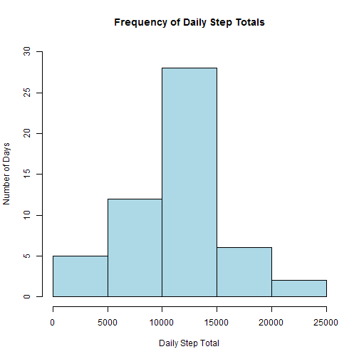
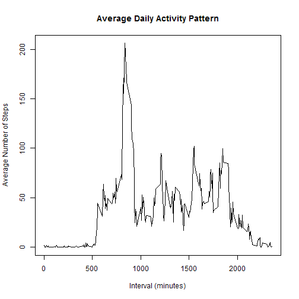
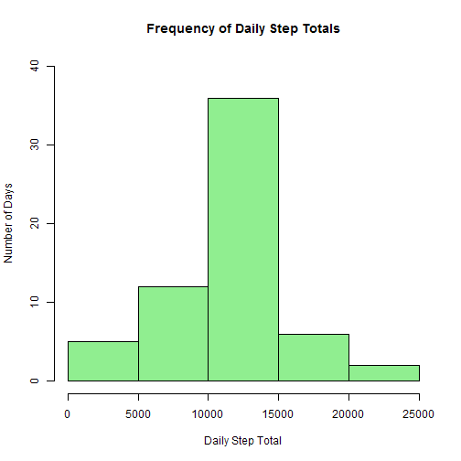
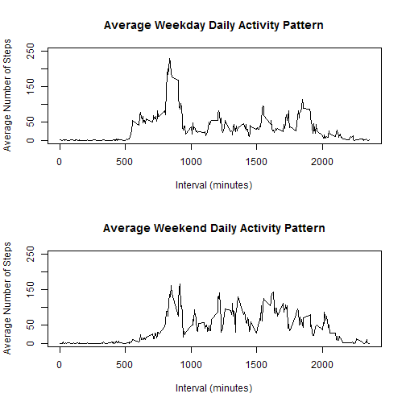

Reproducible Research: Peer Assessment 1
========================================

The purpose of this project is to use data taken from a personal activity monitoring device to analyze the total number of steps per day, the daily activity pattern, and the difference between weekday and weekend activity. The data set describes the activity of one individual over the course of two months (October-November 2012) with data collected every 5 minutes during this period. This analysis will be broken out into several steps:

- Loading and preprocessing the data
- Determining the mean total number of steps taken per day
- Analyzing the average daily activity pattern
- Filling in missing values
- Analyzing differences in activity between weekdays and weekends


## Loading and preprocessing the data

The first step of this project is to import the data and do preprocessing. This is done by using the "read.csv" function to import the "activity.csv" file (which needs to be in the user's working directory) into R. The "colClasses" function is then used to convert the "date" column to a Date class. Next, the total steps taken per day are calculated by using the "tapply" function. The first six entries from "activity.csv" and the first six daily step totals are shown below as an example.


```r
data <- read.csv("activity.csv", colClasses=c(date="Date"))
head(data)
```

```
##   steps       date interval
## 1    NA 2012-10-01        0
## 2    NA 2012-10-01        5
## 3    NA 2012-10-01       10
## 4    NA 2012-10-01       15
## 5    NA 2012-10-01       20
## 6    NA 2012-10-01       25
```

```r
totals <- tapply(data$steps, data$date, sum)
head(totals)
```

```
## 2012-10-01 2012-10-02 2012-10-03 2012-10-04 2012-10-05 2012-10-06 
##         NA        126      11352      12116      13294      15420
```


## What is mean total number of steps taken per day?

To better understand the average number of steps taken per day, a histogram, mean calculation, and median calculation can be used to describe the distribution of the data. Using the "totals" variable above, a histogram can be used to show the frequency of different daily step totals. The histogram below categorizes the data in groups of 5000 steps. From this, we can see that the user reached 10000-15000 steps/day most frequently, followed by 5000-10000 steps/day.


```r
hist(totals, xlab = "Daily Step Total", ylab = "Number of Days", main = "Frequency of Daily Step Totals", col = "lightblue", ylim = c(0,30))
```

 

The mean and median are then calculated based on the "totals" variable. 


```r
mean(totals, na.rm=TRUE)
```

```
## [1] 10766
```

```r
median(totals, na.rm=TRUE)
```

```
## [1] 10765
```

The mean for this data set is 10766 and the median is 10765. Looking at the histogram and the similarity between the mean and median, it appears that this data set approximates a normal distribution.


## What is the average daily activity pattern?

Next, we need to determine what the average daily activity pattern is and which 5-minute time interval had the most activity over the two month period (October-November 2012). That is, during which part of the day was the user most active? This can be found by averaging the number of steps taken by 5-minute interval (using the "aggregate" function), and then plotting the data using a time series plot (where type = "l").

```r
meaninterval <- aggregate(data$steps ~ data$interval, FUN = "mean")
colnames(meaninterval) <- c("interval","steps")
plot(meaninterval, type="l", xlab = "Interval (minutes)", ylab = "Average Number of Steps", main = "Average Daily Activity Pattern")
```

 

```r
with(meaninterval,interval[steps==max(steps)])
```

```
## [1] 835
```

```r
max(meaninterval[,2])
```

```
## [1] 206.2
```

Based on the graph and the "max" and "with" functions above, we can see that the user was most active at interval 835, where the average number of steps was 206.2.

## Imputing missing values

To this point, several values in the data set have been recorded as NAs. Using the "summary" function, we can count how many NA values are present in the "steps" data.


```r
summary(data$steps)
```

```
##    Min. 1st Qu.  Median    Mean 3rd Qu.    Max.    NA's 
##     0.0     0.0     0.0    37.4    12.0   806.0    2304
```

To see what the impact of the missing (NA) data is, the NA values can be replaced with other values. In this case, the NA values can be replaced with the mean value for that 5-minute interval. For example, the number of steps at interval 0 on 2012-10-01 is missing, but can be populated with the mean of all interval 0 values during the two month period (1.717). This can be done by merging the "data" and "meaninterval" data frames used in the previous steps to append the interval's mean value to the end of the new "mergedata" data frame. Next, using subsetting, the NA values can be selected and replaced by the mean interval values. 


```r
mergedata <- merge(data, meaninterval, by.x="interval", by.y="interval")
head(mergedata)
```

```
##   interval steps.x       date steps.y
## 1        0      NA 2012-10-01   1.717
## 2        0       0 2012-11-23   1.717
## 3        0       0 2012-10-28   1.717
## 4        0       0 2012-11-06   1.717
## 5        0       0 2012-11-24   1.717
## 6        0       0 2012-11-15   1.717
```

```r
mergedata$steps.x[is.na(mergedata$steps.x)] <- mergedata$steps.y[is.na(mergedata$steps.x)]
head(mergedata)
```

```
##   interval steps.x       date steps.y
## 1        0   1.717 2012-10-01   1.717
## 2        0   0.000 2012-11-23   1.717
## 3        0   0.000 2012-10-28   1.717
## 4        0   0.000 2012-11-06   1.717
## 5        0   0.000 2012-11-24   1.717
## 6        0   0.000 2012-11-15   1.717
```

In the samples above, we observe that interval 0 on 2012-10-01 had no data for steps, but once the NA values were selected and replaced, the "NA" value was replaced by the average for interval 0, which is 1.717.

With the missing values replaced, the next step is to plot a histogram, calculate the mean, and calculate the median of the data set to determine the effect of the missing data on the results. Like with the previous histogram, this can be done by using the "tapply" function to calculate the total number of steps per day. This histogram looks similar to the previous histogram, but notably, the frequency of daily step totals in the range of 10000-15000 increased. The mean and median values were approximately the same as they were in the previous data set (the median increased from 10765 to 10766).


```r
mergetotals <- tapply(mergedata$steps.x, mergedata$date, sum)
hist(mergetotals, xlab = "Daily Step Total", ylab = "Number of Days", main = "Frequency of Daily Step Totals", col = "lightgreen", ylim = c(0,40))
```

 

```r
mean(mergetotals)
```

```
## [1] 10766
```

```r
median(mergetotals)
```

```
## [1] 10766
```

## Are there differences in activity patterns between weekdays and weekends?

For the final comparison, the data set without missing values will be split into two groups, "weekday" and "weekend," to observe differences between weekday and weekend activity levels. This can be done by using the "weekdays" function to determine the day of the week, using the "ifelse" function to separate the weekdays from the weekends, then using the "aggregate" function to find the average number of steps per interval for weekdays and weekends.


```r
day <- weekdays(mergedata$date)
wkdata <- cbind(mergedata,day)
wkdata_det <- ifelse (wkdata$day %in% c("Saturday","Sunday"), "weekend", "weekday")
wkdata <- cbind(wkdata, wkdata_det)
weekday <- wkdata[wkdata$wkdata_det=="weekday",]
weekend <- wkdata[wkdata$wkdata_det=="weekend",]
weekday_agg <- aggregate(weekday$steps.x ~ weekday$interval, FUN = "mean")
weekend_agg <- aggregate(weekend$steps.x ~ weekend$interval, FUN = "mean")
```

Finally, the "weekday_agg" and "weekend_agg" can be plotted on a time series panel plot to observe differences in weekday and weekend activity levels. Based on these graphs, it appears that there is typically more activity on weekends than on weekdays.


```r
par(mfrow=c(2,1))
plot(weekday_agg, type="l", xlab = "Interval (minutes)", ylab = "Average Number of Steps", main = "Average Weekday Daily Activity Pattern", ylim = c(0,250))
plot(weekend_agg, type="l", xlab = "Interval (minutes)", ylab = "Average Number of Steps", main = "Average Weekend Daily Activity Pattern", ylim = c(0,250))
```

 
